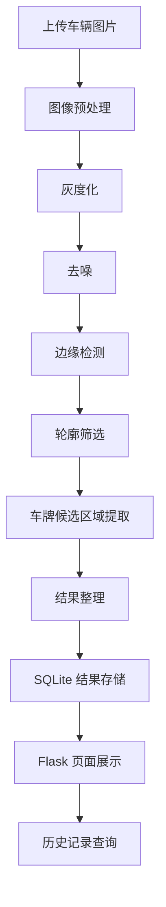

# 项目流程图

## Mermaid 版本



## 文字版说明

1. 用户上传车辆图片  
2. 系统使用 OpenCV 对图片进行灰度化、去噪和边缘检测  
3. 通过轮廓筛选定位车牌候选区域  
4. 提取候选区域并生成处理结果图  
5. 将识别结果和图片信息写入 SQLite  
6. 使用 Flask 页面展示处理结果和历史记录

## 适合放在 GitHub README 的简版

```text
图片上传 -> 图像预处理 -> 边缘检测 -> 轮廓筛选 -> 车牌候选区域提取 -> 结果保存 -> SQLite存储 -> Flask页面展示
```
